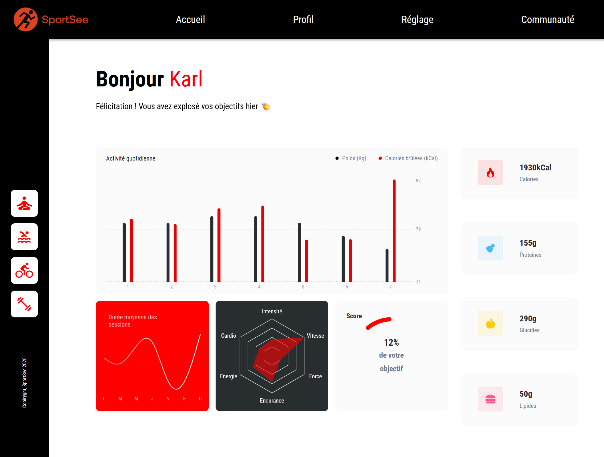

# SportSee

SportSee est une application de suivi de la condition physique qui permet aux utilisateurs de suivre leurs activités, leurs objectifs et leurs performances. L'application utilise React pour le frontend et Axios pour les appels API.

## Table des matières

- [Aperçu](#aperçu)
- [Prérequis](#prérequis)
- [Installation](#installation)
- [Lancement du backend](#lancement-du-backend)
- [Configuration](#configuration)
- [Démarrage](#démarrage)
- [Fonctionnalités](#fonctionnalités)
- [Structure du projet](#structure-du-projet)
- [Utilisation](#utilisation)
- [Scripts](#scripts)
- [Technologies utilisées](#technologies-utilisées)
- [Licence](#licence)

## Aperçu



## Prérequis
- Node.js
- Yarn ou npm

## Installation
1. Clonez le dépôt :
    ```bash
    git clone https://github.com/Nayel9/SportSee.git
    ```
2. Accédez au répertoire du projet :
    ```bash
    cd SportSee
    ```
3. Installez les dépendances :
    ```bash
    yarn install
    ```
    ou
    ```bash
    npm install
    ```
## Lancement du backend

Pour démarrer le backend en mode développement :
```bash
cd backend
yarn dev
```

## Configuration
Modifiez le fichier `frontend/src/config.js` pour configurer l'URL de base de l'API et l'utilisation des données mockées.

## Démarrage
Pour démarrer l'application en mode développement :
```bash
yarn start
```

## Fonctionnalités

- Affichage des informations de l'utilisateur
- Navigation avec React Router
- Gestion des erreurs pour les pages non trouvées
- Utilisation de données mockées ou réelles à partir de l'API
- Suivi des activités, des performances et des objectifs de l'utilisateur

## Structure du projet

Voici un aperçu de la structure des fichiers du projet :

```
SportSee/
├── backend/
│   ├── README.md
│   ├── package.json
│   └── server.js
├── frontend/
│   ├── public/
│   │   └── index.html
│   ├── src/
│   │   ├── components/
│   │   │   ├── Navbar/
│   │   │   └── Footer/
│   │   ├── pages/
│   │   │   └── Profile/
│   │   ├── services/
│   │   │   └── apiService.js
│   │   ├── style/
│   │   │   └── global.scss
│   │   ├── config.js
│   │   ├── index.jsx
│   │   └── router.jsx
│   ├── .gitignore
│   └── package.json
└── README.md
```
## Utilisation

- Ouvrez votre navigateur et accédez à http://localhost:5173/SportSee.
- Naviguez vers la page de profil utilisateur en utilisant l'URL http://localhost:5173/SportSee/Pages/Profile/user/:id où :id est l'identifiant de l'utilisateur.
- Consultez les données de l'utilisateur, ses activités, ses performances et ses objectifs.

## Scripts

- `yarn start` : démarre l'application en mode développement.
- `yarn build` : crée une version de production de l'application.
- `yarn test` : lance les tests unitaires.

## Technologies utilisées

- React : pour la construction de l'interface utilisateur.
- Axios : pour les appels API.
- Recharts : pour les graphiques et les tableaux de bord.
- React Router : pour la navigation dans l'application.
- SCSS : pour les styles CSS.
- Eslint : pour la vérification du code.
- Prettier : pour le formatage du code.

## Licence
Ce projet est sous licence MIT. Consultez le fichier LICENSE pour plus d'informations.